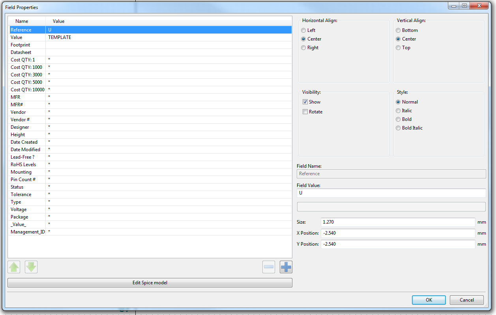

# AVR-method A KiCAD Library Standard
My Personal KiCAD Library Management Workflow and practices. A Standard on which
to develop well organized and informative KiCAD libraries.Hackaday Project:
https://hackaday.io/project/162410-avr-method-a-kicad-library-standard

## Schematic Symbol Library Specifications
Components should be separated by types into the following categories:
Resistors, Capacitors, Connectors, ICs, and Special.  
#### Symbol Metadata
Schematic symbols contain several kinds of metadata. This metadata is for
making the BOM more informative to the PCB assembler. It also is for keeping
track of part lifecycle, cost, function, and information all in one place, the
part symbol itself. All components have the same metadata fields. This keeps the BOM generation simple and consistent. If  given component does not have entry for one of the metadata fields, simply leave the default value of * in place. In the future I'm going to develop a library management tool for that utilizes this metadata system I've developed over the years.

##### KiCAD Reserved:
* Reference - the character used for the designator
* Value - displays the library reference name of the part.
* Footprint - displays KiCAD footprint linked to symbol
* Datasheet - URL for the datasheet of part

##### AVR-Method Defined:
* Cost QTY:1 - Price in quantity of 1 for the listed vendor
* Cost QTY:1000 - Price in quantity of 1000 for the listed vendor
* Cost QTY:3000 - Price in quantity of 3000 for the listed vendor
* Cost QTY:5000 - Price in quantity of 5000 for the listed vendor
* Cost QTY:10000 - Price in quantity of 10000 for the listed vendor
* MFR - component manufacture
* MFR# -  manufacture part number for Component
* Vendor - vendor of choice for purchasing component
* Vendor # - vendor part number
* Designer -  Design engineer who drew symbol
* Height - component height on PCB, assemblers appreciate this information alot
* Date Created - Date symbol is created and added to library
* Date Modified - the last date on which the symbol was modified in any way
* Lead-Free? - Is the component lead free/RoHS compliant
* RoHS Levels - If so what level(s) of RoHS compliance does it have
* Mounting - SMT or through hole mounting, how component mounts to PCB etc
* Pin Count # - amount of pins on component for applicable parts
* Status - whether or not the component is in active production or discontinued
* Tolerance - tolerance margin of the component value on appplicable components
* Type - Type of component, passive, IC, connector, resistor, cap, etc.
* Voltage -  Voltage rating of the component where applicable
* Package -  component standardized package, 0603 resistors, QFNs, TQFP, etc
* Description - Short Description about the part, usually the Digikey one
* \_Value\_ - For displaying the component value of a passive or IC part number
* Management_ID - AVR-Method unique ID for tracking component lifecycle

#### Capacitors
Capacitors are contained within their own sub-library, I keep all types of
capacitors in one library, if you have many capacitors of various types it might
be more helpful to have additional sub libraries but find this makes Schematic
capture even longer. Designator letter C

#### Resistors
Resistors are contained within their own sub-library, all types in one, I only
use SMT resistors so there isn't much variation aside from size. Designator
letter R.

#### Inductors
Contains all inductors and inductor type components, designator letter L.

#### Connectors
All Connectors in one library. Designator Lettor T.

#### ICs (Integrated Circuits)
All ICs in one library, if you have a diverse collection perhaps sublibraries for types, but remember cycling through folders is a waste of time that could be better spent drawring the schematic. Designator Letter U.

#### Mounting Holes & Fasteners
All mounting holes of all types, holes for screws of various size, standoffs,PEMS, etc.
Designator letter H.

#### Special
The Special category is for PCB mounted components that are out of the ordinary. These parts don't always have to be electrical. A good example is the lens mount for a camera image sensor that has to be board mounted. Another common example would be fiducials for pick and place assembly alignment. Designator letter SP. 

#### Management ID
The Management ID is a unique alpha numeric string used as an identifier for each component relative to the library as a whole. The number contains the type of component, date created, and a unique 8 digit alpha numeric identifier string.

Example:

CAP-09092018-F8T4YU35

RES-08082018-G94EY76U

ICS-11162018-H8UI9R56

CON-12092018-J8R77GQ9

SPE-07122018-H8U99G03

#### Example of Fields:

